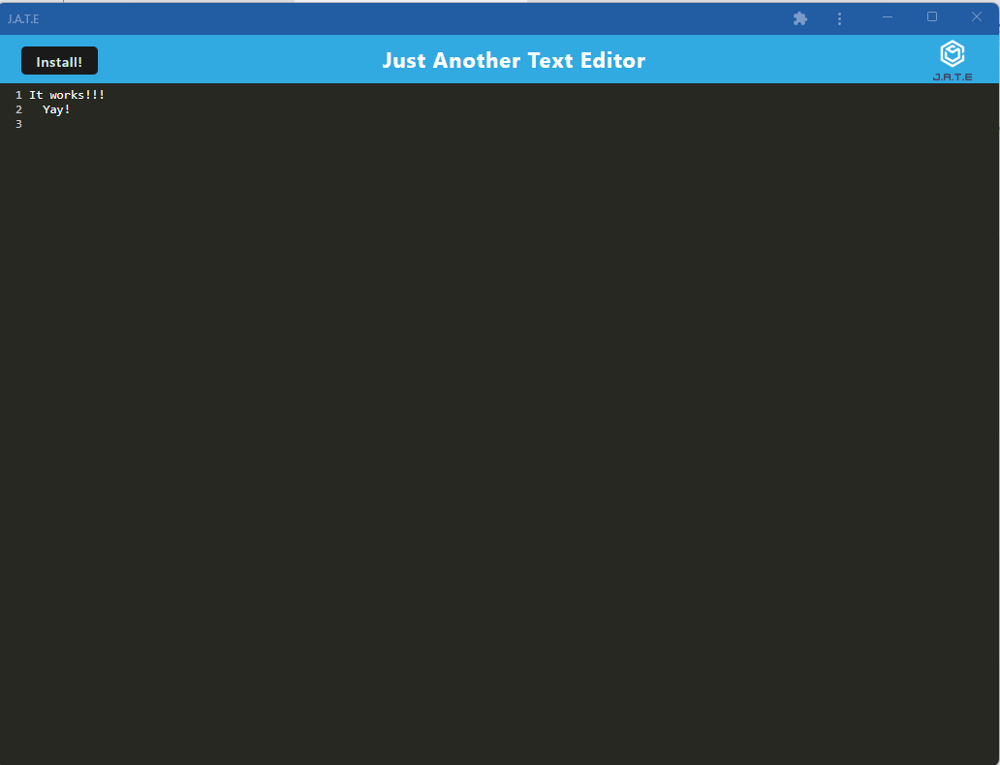

# 19-Text_Eddy

# Description

This is a THE MOST AWESOME Text editor EVER! it allows the user to download the text editor and work with it offline. Any changes made offline will be update in the live version of the application once the user is connected again.

## Installation

N/A

## Usage

- This is an application that will allow the user to :
  - Download a version of the application
  - Work with the application offline
  - Updates the changes made offline once the user logs in again
  - See screenshot of online version 
  - See screenshot of installed offline version 

## Credits

- frosemond (from HelpBC), who showed me the missing Todos
- Armando Osorio, who assisted with additonal explanantions and to get the code working

## License

Please refer to LICENSE in the repo
